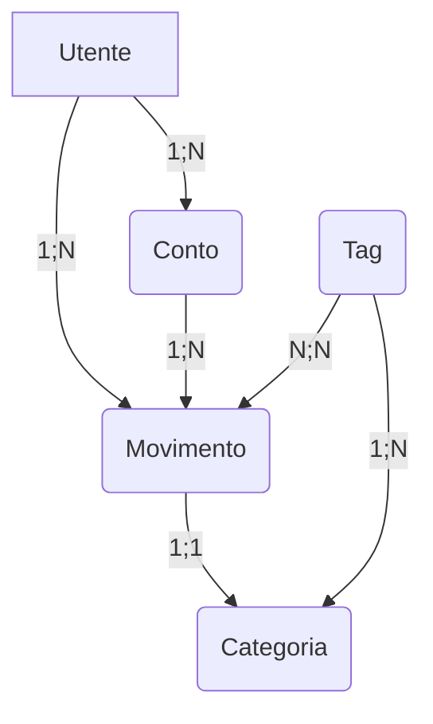
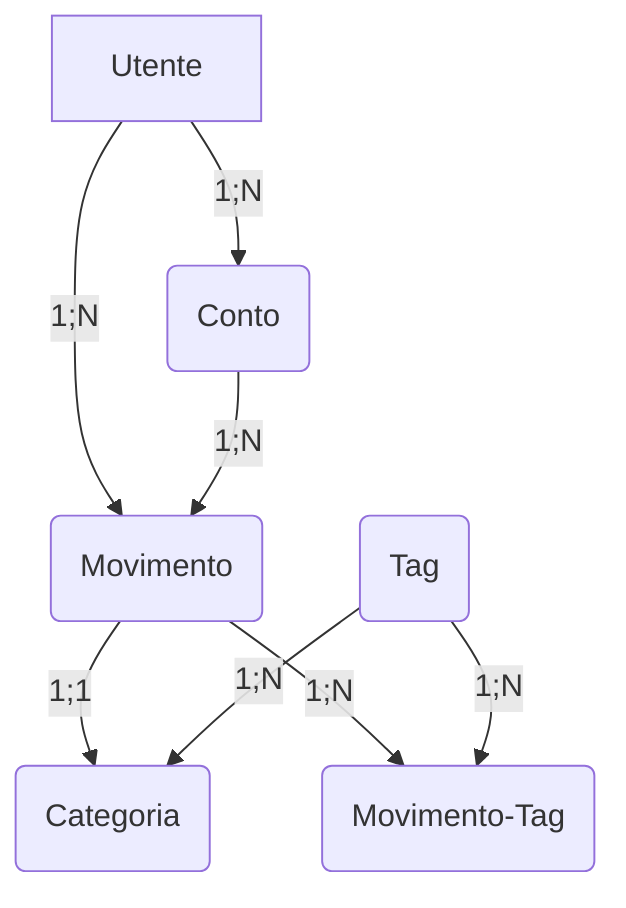
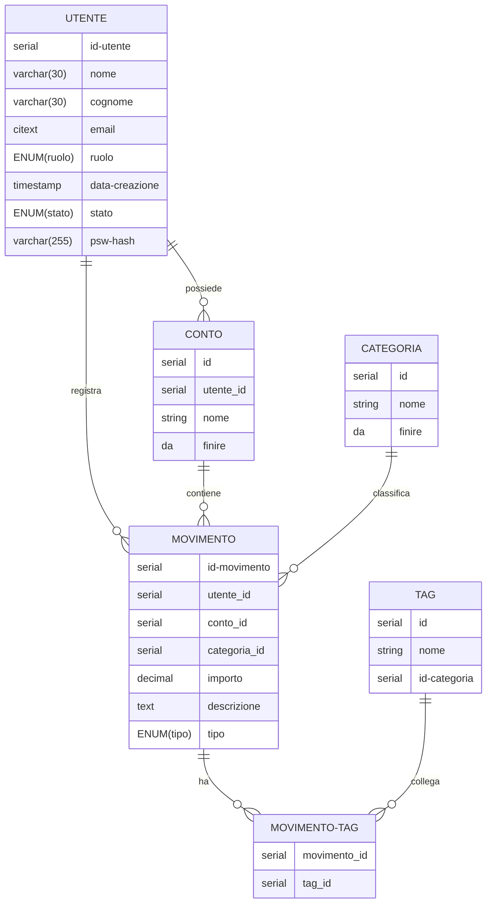
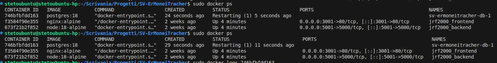
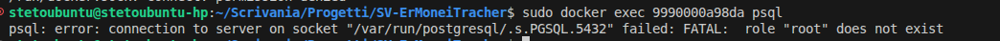
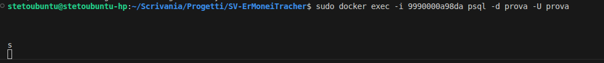
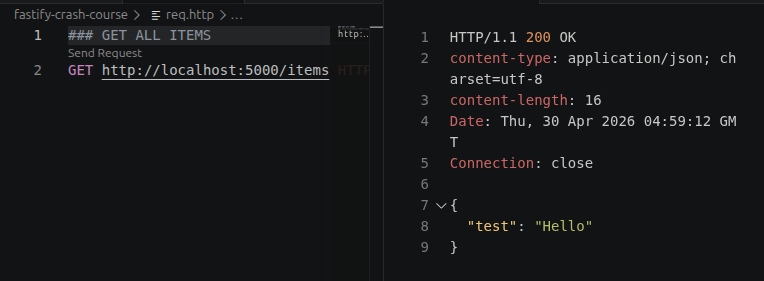

# Perchè questo file?

Il motivo di questo file è mantenere una motivazione dietro le mie scelte ed avere uno storico da tenere pubblico per il processo che ho seguito per ogni scelta del progetto.

## LO STACK

Per il momento mi sono appoggiato su uno stack facile, su cui so già mettere le mani senza dover strafare nulla, l'obbiettivo è fare un progetto da cui imparare, non vendere qualcosa.

Per questo motivo lo stack che andrò a seguire, come scritto nel README.MD è:
- Backend -> Node
- Frontend -> Vanilla js e html
- Database -> Postgresql

Un parte del progetto in futuro potrebbe includere la sostituzione di una delle tecnologie, come il frontend con uno basato su react.

## 31-03-2026 .GITIGNORE

Prima di iniziare, controllo il .gitignore che abbia tutto quello che mi interessa (per ora) che ignori.

Quando ho creato il repo l'ho creato con il modello node quindi le cartelle principali create da un backend node dovrebbe già ignorarle, come node_modules, .env etc... ma verifichiamo.

R. Sì, se vai a guardare il file .ignore a questo commit si può vedere come l'inserimento del file .ignore da modello ha messo tutto quello di cui necessitiamo per ora.

## 31-03-2026 STRUTTURA CARTELLE 

Adesso andiamo intanto a creare la struttura delle cartelle per il nostro progetto, così da separare backend, database e frontend. 

Quindi:
mkdir backend database frontend

Da qui, in database e backend non andiamo a creare nessuna cartella poichè:
- Per il backend quando andiamo a creare il progetto node creeerà lui la struttura di cartelle
- Per il database non ci dovrebbe interessare creare cartelle per dividere il tutto, le faremo all'eventualità.

Però possiamo farle per il frontend, sicuramente ci serviranno:
cd frontend
mkdir html css js media 

Per ora facciamo solo queste, non sono quelle perfette o che occupano tutti i casi d'uso del fronend, però ci bastano per adesso per creare un frontend base per operatività.

## 31-03-2026 CHE SI FA

Direi proprio che la prima cosa che mi conviene più fare è definire lo schema del db, ho già fatto uno spunto nel file ReadME.md in uno schema mermaid:



Però sicuramente intanto possiamo definire i campi, li ho segnati in uno schema che mi sono fatto su carta quindi potrei aggiungerli allo schema mermaid, devo un'attimo sgooglare come si aggiungevano i campi alle tabelle di mermaid.

Ho detto una cazzata, su marmaid non si possono mettere le tabelle, però le posso scrivere in markdown, visto che scriverle in markdown sarebbe un pugno in culo uso questo strumento che ho trovato:

https://www.tablesgenerator.com/markdown_tables

Note: 
- In postgres il tipo "serial" è un valore auto incrementale, quindi funge la funzione di AUTO INCREMENT che avevo visto in MySQL a scuola e a cui ero abituato.

## Tabella Utente

Intanto scrivo i primi campi standard che mi vengono immediatamente in mente senza neanche pensarci:


| Nome Campo 	| Tipo        	| PK 	| FK 	|
|------------	|-------------	|----	|----	|
| id-utente  	| serial      	| Si 	|    	|
| Nome       	| varchar(30) 	|    	|    	|
| Cognome    	| varchar(30) 	|    	|    	|


Stavo scrivendo le proprietà che mi interessano della tabella e per trovare il giusto tipo da dare al campo email ho trovato questo thread di stack overflow molto utile:

https://stackoverflow.com/questions/62113787/what-should-be-the-data-type-of-field-email-in-postgresql-database-in-pgadmin

Dove si parla di questo campo CITEXT dove ignora il maiuscolo e minuscolo quando fa una comparazione di valori, e nel caso delle mail che è molto importante che non si duplichino è giusto che non permetta due ingressi di questo tipo: steph.villans@gmail.com e Steph.Villans@gmail.com

Dice anche che questo type fa parte di un estensione di nome citext, dovrei approfondire cosa sono le estensioni in postgres.

<details>
<summary><strong> Estensioni POSTGRESQL </strong></summary>

Estensioni POSTGRESQL

Beh ci ho guardato e le estensioni sono proprio quello che si può immaginare, componenti aggiuntivi per postgresql che ne permettono l'ampliazione delle funzionalità.

Giusto per esser completi, l'estensione citext che interessa a me in sostanza, trasforma tutte le stringhe con questo tipo in minuscolo nel momento in cui si devono confrontare con altri valori.

Da tenere a mente che comunque memorizza nel db il valore AS-IS, nel senso che se io mi registro scrivendo:
    Steph.Villans@Gmail.com
Quando fa i confronti li farà con il valore "steph.villans@gmail.com" ma il valore registrato sul db sarà sempre "Steph.Villans@Gmail.com".

</details>

***


| Nome Campo 	| Tipo        	| PK 	| FK 	|
|------------	|-------------	|----	|----	|
| id-utente  	| serial      	| Si 	|    	|
| Nome       	| varchar(30) 	|    	|    	|
| Cognome    	| varchar(30) 	|    	|    	|
| Email      	| citext      	|    	|    	|

Per il ruolo dell'utente andiamo ad usare ENUM.

ENUM vuol dire che il tipo di dato lo andrò a creare io, in questo caso sarà così:

CREATE TYPE ruolo-utente AS ENUM ('standard', 'pro', 'admin');


| Nome Campo 	| Tipo        	| PK 	| FK 	|
|------------	|-------------	|----	|----	|
| id-utente  	| serial      	| Si 	|    	|
| Nome       	| varchar(30) 	|    	|    	|
| Cognome    	| varchar(30) 	|    	|    	|
| Email      	| citext      	|    	|    	|
| ruolo-utente      	| ENUM(ruolo-utente)     	|    	|    	|

Poi abbiamo sicuramente:
- data-creazione, probabilmente il data-type è il date, però ho trovato che c'è anche timestamp, quindi voglio vedere cosa è più adatto, PS. si il giusto è TIMESTAMP, e si aggiunge valore di DEFAULT NOW()
- stato, enum attivo/disattivo

Questione password, direi che ci facciamo un campo dedicato in cui viene salvata la password hashata con un algoritmo non reversibile.

Mi sono informato adesso nel cryptare le password, ho letto un paio di articoli interessanti:
- https://blog.codinghorror.com/youre-probably-storing-passwords-incorrectly/
- https://web.archive.org/web/20070915191117/http://www.matasano.com/log/958/enough-with-the-rainbow-tables-what-you-need-to-know-about-secure-password-schemes/

(Bellini comunque!)

E quanto ho potuto apprendere è:
- non inventarmi nulla
- Usa quello che gente molto più intelligente di te ha già fatto

Quindi usiamo bcrypt, ma come lo implemento nel mio db? GOOGLE!

E qui ho trovato una domanda stack overflow che fa proprio al caso mio:
https://stackoverflow.com/questions/2647158/how-can-i-hash-passwords-in-postgresql

### Implementare bcrypt nel db, CA' DEVO FA'?

Allora stavo leggendo la domanda di stack overflow ma ho notato una cosa, in quella domanda mandano la password in chiaro al db e il db la salva dopo averla criptata, però non mi fa impazzire come cosa.

Perchè questo vorrebbe dire che la password deve fare 2 salti non in chiaro, da frontend a backend, e da backend a database.

Quindi, visto che il mio backend vuole essere node.js guardo se è possibile cryptare con bcrypt nel backend.
N.B. per questo tiro una bella sgippata, facendo cross reference sgooglando.

In node.js esiste un pacchetto dedicato ad utilizzare bcrypt.
npm install bcrypt

Fa l'esempio di usare questi dati:```
```js
const bcrypt = require('bcrypt');

const plainPassword = req.body.password;
const saltRounds = 12;

const passwordHash = await bcrypt.hash(plainPassword, saltRounds);

// salva passwordHash nel db
```
Per un'ipotetico Login

e per il register:
```js
const bcrypt = require('bcrypt');

// password inserita dall'utente
const plainPassword = req.body.password;

// hash preso dal db
const passwordHashFromDb = user.password_hash;

const isValid = await bcrypt.compare(plainPassword, passwordHashFromDb);

if (!isValid) {
return res.status(401).json({ error: 'Credenziali non valide' });
}
```

In sostanza i metodi principali sono .hash e .compare.

Quindi, nel consisto che è il salting che usa bcrypt? visto che lo si usa per l'hashing devo sapere che cazzo vor dì.

Una spiegazione buona si trova in questa Question:
https://stackoverflow.com/questions/25586073/bcrypt-what-is-meant-salt-and-cost

La sostanza è: Evitare raimbow table attack.

Gli attacchi rainbow table sono attacchi che salvano un tot di password hashate e poi le vanno a provare nei sistemi.
Se noi salvassimo le password hashandole solo queste sarebbero vulnerabili a questo tipo di attacco, poichè se qualcuno ha una password come "prova123" questa sarebbe facile da hashare e provare.

AD ESEMPIO: 
password non hashata = prova123 
password hashata = e32ae4e0d9158c00684ec73ce7803ab1

Se qualcun'altro hashasse la password prova123, riuscirebbe a ricavare lo stesso hash, ed entrare.

Il salting cerca di prevenire questo, una volta che viene salvata una password si aggiunge il salt, ovvero una stringa di caratteri alfanumerici casuale che permette di salvare la password in maniera molto più sicura

AD ESEMPIO: 
password non hashata = prova123 
SALT = "d15sa1ca515d" 
password hashata (salt + psw) = 0c435e1ba4ad9ab1994b29f7ebcb2356

Sono hash completamente diversi, ma una raimbow table non avrà mai al suo interno un hash di "d15sa1ca515dprova123".

La password di esempio rimane debole, ma bcrypt aggiunge in questo modo un layer di sicurezza.

***


Quindi nella tabella, la password la salviamo così:

| Nome Campo 	| Tipo        	| PK 	| FK 	|
|------------	|-------------	|----	|----	|
| id-utente  	| serial      	| Si 	|    	|
| Nome       	| varchar(30) 	|    	|    	|
| Cognome    	| varchar(30) 	|    	|    	|
| Email      	| citext      	|    	|    	|
| ruolo-utente      	| ENUM(ruolo-utente)     	|    	|    	|
| data-creazione      	| TIMESTAMP DEFAULT NOW()     	|    	|    	|
| stato-utente   	| ENUM(stato-utente)     	|    	|    	|
| psw-hash     	| VARCHAR(255)     	|    	|    	|


con lo stato:
CREATE TYPE stato-utente AS ENUM ('attivo', 'disattivo');
CREATE TYPE stato-utente AS ENUM ('attivo', 'disattivo');
CREATE TYPE stato-utente AS ENUM ('attivo', 'disattivo');

# 01-04-2026

## Continuiamo il DB SCHEMA

Ieri abbiamo direi finito la tabella per gli utenti, per ora di quella mi sento relativamente contento per quella, quindi intanto continuiamo con le altre, tanto sicuramente andrà completata viste le relazioni con le altre tabelle.

## TABELLA MOVIMENTO

L'obbiettivo di questa tabella è quello di salvare ogni singolo movimento monetario che viene eseguito, quindi:
- Uscita
- Ingressi
- Trasferimenti

Direi che questi sono i 3 casi principali, che in realtà tratterei come 2 tipi, nel senso che un trasferimento è solo un uscita da un conto ed un ingresso su un'altro.

Un movimento quindi ha sicuramente:
- id-movimento, PK per gestire il fatto che siano univochi
- id-contoid-conto, FK, indica su che conto è stato effettuato un movimento
- importo, a quanto ammonta il movimento
- descrizione, una descrizione sul movimento
- id-categoria, FK indica a quale categoria appartiene il movimento
- tipo-movimento, ENUM ingresso/uscita per determinare che tipo di movimento è stato fatto.
- id-tag, FK

Il problema qui è l'id-tag, poichè per la mia interpretazione ogni movimento può avere più tag assegnati, ma come salvo per ogni record in movimenti pià id-tag?

Qui si sgoogla.

Ok, avevo un ricordo da scuola e immaginavo fosse così ma volevo esserne sicuro.

Essendo che nel nostro schema, un movimento può avere più tag e un tag può avere più movimenti, quindi la relazione tra le due tabelle è N:N (Molti a Molti), si può creare una tabella ponte con solo i campi che ci interessano.

## TABELLA MOVIMENTO-TAG

| Nome Campo 	| Tipo        	| PK 	| FK 	|
|------------	|-------------	|----	|----	|
| id-movimento  	| serial      	| 	|  SI  	|
| id-tag       	| serial 	|    	|   SI 	|

Nella quale la PK è creata dalla combinazione dei due ID, quindi PK è (id-movimento, id-tag).

## TABELLA MOVIMENTO

Quindi i dati che ci interessa avere poi nella tabella di Movimenti è questo (senza id-tag)

| Nome Campo 	| Tipo        	| PK 	| FK 	|
|------------	|-------------	|----	|----	|
| id-movimento  	| serial      	| SI 	|    	|
| id-conto       	| serial 	|    	|    SI	|
| importo       	| decimal (2 posizioni di precisione) 	|    	|   	|
| descrizione       	| text 	|    	|    	|
| id-categoria       	| serial 	|    	|    SI	|
| tipo-movimento       	| ENUM(ingresso/uscita) 	|    	|    SI	|

PS. Aggiungo anche l'id dell'utente che fa il movimento, perchè è vero che il conto è legato all'utente, ma potenzialmente può rendere i dati più consistenti e completi segnare anche chi è l'utente che ha fatto il movimento

| Nome Campo 	| Tipo        	| PK 	| FK 	|
|------------	|-------------	|----	|----	|
| id-movimento  	| serial      	| SI 	|    	|
| id-conto       	| serial 	|    	|    SI	|
| importo       	| decimal (2 posizioni di precisione) 	|    	|   	|
| descrizione       	| text 	|    	|    	|
| id-categoria       	| serial 	|    	|    SI	|
| tipo-movimento       	| ENUM(ingresso/uscita) 	|    	|    	|
| id-utente       	| serial 	|    	|    SI	|


## CORREGGIAMO mermeid

Visto il cambiamento affrontato nel db schema, aggiorniamo lo schema mermeid:




## TABELLA TAG

Per quanto riguarda la tabella tag, dobbiamo salvare relativamente poco:

| Nome Campo 	| Tipo        	| PK 	| FK 	|
|------------	|-------------	|----	|----	|
| id-tag  	| serial      	| SI 	|    	|
| nome | varchar(255) | | |
| id-categoria | serial | | SI |

STOP!

Ho messo in pausa la scrittura della tabella perchè ho sbagliato tutto finora, ho usato per mermail il diagramma di flusso, dovevo usare il componente mermaid erDiagram, che mi permette di gestire le relazioni tra tabelle, mettendo anche gli attributi.

La documentazione basa di questa cosa è la seguente:

Basic Elements

    Entities: entity EntityName
    Attributes: Listed within entities
    Relationships: Various types of connections between entities
    Cardinality: |o--o|, }o--o{, etc.

Relationship Types

    One-to-One: ||--||
    One-to-Many: ||--o{
    Many-to-One: }o--||
    Many-to-Many: }o--o{

Comunque per altre info:
https://docs.mermaidviewer.com/diagrams/er.html

Per lo schema del mio db:


Ok quindi, aggiustato questo, possiamo continuare a modellare il db, mancano queste tabelle:
- conto
- categoria

## TABELLA CONTO

Allora la tabella con le prime cose che mi vengono in mente è così:

| Nome Campo 	| Tipo        	| PK 	| FK 	|
|------------	|-------------	|----	|----	|
| id-conto  	| serial      	| SI 	|    	|
| id-user       	| serial 	|    	|    SI	|
| nome       	| varchar(255) 	|    	|   	|
| saldo-iniziale   	| decimal (2 posizioni di precisione) |  |  |
| saldo-attuale       	| decimal (2 posizioni di precisione) |  |  |

Per ora mi vengono in mente queste suddivisioni, forse un'altro campo che potrebbe essere utile è:
- tipo di conto, e mettere un enum con tipo banca, contanti, carta di debito, carta di credito, non mi serve particolarmente però potrebbe essere utile, nel senso che potrei magari voler filtrare quante spese ho fatto tra diverse carte di credito e sommarle

Ora che ci penso probabilmente la distinzione tra saldo-iniziale e saldo-attuale non serve, tanto il saldo iniziale si mette solo quando si crea il conto, dopo non si modifica più, quindi se invece che metterlo come campo lo faccio inserire in fase di creazione conto e poi lo metto direttamente in saldo attuale direi che cambia poco.

Quindi direi che per ora la tabella conto è la seguente:

| Nome Campo 	| Tipo        	| PK 	| FK 	|
|------------	|-------------	|----	|----	|
| id-conto  	| serial      	| SI 	|    	|
| id-user       	| serial 	|    	|    SI	|
| nome       	| varchar(255) 	|    	|   	|
| tipo   	| ENUM(carte,banca,contanti) |  |  |
| saldo-attuale       	| decimal (2 posizioni di precisione) |  |  |

Vado a modificare lo schema db nel readme...

Fatto.

## TABELLA CATEGORIA

Allora come prima, la butto giù su due piedi, poi la ragiono meglio:


| Nome Campo 	| Tipo        	| PK 	| FK 	|
|------------	|-------------	|----	|----	|
| id-categoria  	| serial      	| SI 	|    	|
| id-movimento       	| serial 	|    	|    SI	|
| nome       	| varchar(255) 	|    	|   	|

Al momento mi vengono solo queste cose sinceramente, perchè l'obbiettivo delle categorie è semplicemente dividere le spese, per evitare di fare un grosso enum invece di usare una tabella.

Perchè l'alternativa era quella di creare un grosso enum per tutte le categorie possibili nella tabella movimento, ma se voglio aggiungere una categoria mi sembra poco lineare come ragionamento.

Una cosa che potrebbe aver senso potrebbe essere dare una proprietà alle categorie che rende le spese in quella categorie non contante nelle statistiche (?) non so se potrebbe aver senso.

A pensarci nel privato non mi viene in mente una situazione nella quale vorrei che una spesa che faccio non mi venga segnata, anche perchè rimuoverebbe la logica di segnare le spese in sè per sè, c'è creerebbe delle discrepanze nelle spese e quanto segnato e renderebbe la cosa controintuitiva.

Ah cazzo non ci avevo pensato, il tipo di movimento, ovvero la categoria, è una categoria che si applica solo alle entrate o solo alle spese? o tutte e due.

Ad esempio stipendio, è sicuramente un'entrata, quindi si può fare la separazione tra queste categorie, così che quando si fa per aggiungere una categoria al movimento, appaiano solo le categorie relative ad uscite o entrate.

Quindi direi la tabella definitiva (per ora) è:

| Nome Campo 	| Tipo        	| PK 	| FK 	|
|------------	|-------------	|----	|----	|
| id-categoria  	| serial      	| SI 	|    	|
| id-movimento       	| serial 	|    	|    SI	|
| nome       	| varchar(255) 	|    	|   	|
| tipo       	| ENUM(ingresso,uscita) 	|    	|   	|

Aggiornato anche in readME.md

# 02-04-2026

Allora il db schema lo abbiamo fatto, penso che a livello di ordine di cose da fare nel progetto mi convenga fare prima tutto il db, poi buona parte del backend, poi il frontend.

Questo perchè avendo un db completamente funzionante abbiamo tutti i dati per un'applicazione, una volta che ho il db completo vuol dire che posso fare il backend per usare i dati nel db, e una volta fatto questo il frontend per creare l'app effettiva.

Però sì direi che continuiamo con il db.

## DB IN DOCKER

Quindi, in generale nel progetto, lo scopo è quello di containerizzare tutto, quindi intanto cerchiamo l'immagine docker per postgresql.

Basta andare su docker hub e la troviamo facilmente:
https://hub.docker.com/_/postgres

Visto che noi dobbiamo usare un db normalissimo senza troppe pretese non ci dovrebbe servire creare un dockerfile dedicato, non abbiam bisogno di immagini particolari.

Dalla pagina possiamo vedere un esempio di docker compose e di tutte le variabili d'ambiente di cui può avere bisogno.

Noi non abbiamo troppe pretese, abbiamo bisogno di un db funzionante, che non deve venir esposto direttamente su internet, che mantega i dati in maniera persistente (quindi sicuramente faremo dei volumi) e possibilmente una soluzione per backuppare i dati.

Allora, postgres si potrebbe in realtà eseguire anche solo con:

```bash
docker pull postgres

docker run --name devdb -e POSTGRES_PASSWORD=mysecretpassword -p 5432:5432 -d postgres
```

Con il primo comando eseguirà il pull e con il seconddo eseguiamo il container di base, ovviamente questo sarà un semplice db in esecuzione, quindi senza schermata di amministrazione nè nulla.

Se installassimo un db manager come pgAdmin potremmo connetterci al db in localhost 5432 e potremmo lavorare sul database.

## DOCKER COMPOSE

Andiamo quindi a scegliere un docker compose per il nostro db, ho trovato questo:

```yml
version: '3.8'
services:
  db:
    image: postgres:14.1-alpine
    restart: always
    environment:
      - POSTGRES_USER=postgres
      - POSTGRES_PASSWORD=postgres
    ports:
      - '5432:5432'
    volumes: 
      - db:/var/lib/postgresql/data
volumes:
  db:
    driver: local
```

Da questo sicuramente togliamo il tag version visto che è deprecato, poi vado su docker hub a vedere qual'è l'ultima stable di postgres e usiamo quella:

```yml
services:
  db:
    image: postgres:16-alpine
    restart: always
    environment:
      - POSTGRES_USER=postgres
      - POSTGRES_PASSWORD=postgres
    ports:
      - '5432:5432'
    volumes: 
      - db:/var/lib/postgresql/data
volumes:
  db:
    driver: local
```

Per quanto riguarda la politica di restart ci va bene che si riaccenda ogni volta, per le variabili d'ambiente la facciamo pescare da file .env, se non ti ricordi come i docker compose leggono le variabili d'ambiente:

https://docs.docker.com/compose/how-tos/environment-variables/set-environment-variables/

Articolo di documentazione che spiega bene come usarle, nel nostro caso le dichiariamo semplicemente con: 

`${variabile}`

Tanto il docker compose cercherà il file .env nella directory del progetto.

Visto che nel nostro caso abbiamo un solo .env e un solo docker compose, infatti per ora abbiamo solo il db, ma dopo metteremo insieme anche backend e frontend nel docker compose.

Quindi il nostro docker compose attuale è il seguente:

```yml
services:
  db:
    image: postgres:18
    restart: always
    environment:
      - POSTGRES_USER=${POSTGRES_USER}
      - POSTGRES_PASSWORD=${POSTGRES_PASSWORD}
    ports:
      - '5432:5432'
    volumes: 
      - db:/var/lib/postgresql/data

volumes:
  db:
    driver: local
```

Controlliamo ora sulla documentazione se ci sono altre variabili d'ambiente di cui abbiamo bisogno:

- POSTGRES_DB, nome del db di default

Dalla documentazione mi sembra di trovare solo questa che mi può servire per ora, quindi ormai che ci sono parliamo anche delle porte del db.

Docker compose definisce 2 porte, quella aperta verso l'host e quella usata internamente.

Nel nostro caso, internamente ci va bene che usi la 5432 non ci interessa, sull'host non la esponiamo per 2 motivi:
- Non ci interessa esporla sull'host, aggiunge un punto di accesso non voluto
- Docker compose definisce 2 porte, quella aperta verso l'host e quella usata internamente.

Nel nostro caso, internamente ci va bene che usi la 5432 non ci interessa, sull'host non la esponiamo per 2 motivi:
- Non ci interessa esporla sull'host, aggiunge un punto di accesso non voluto
- I container Docker comunicano tra loro tramite la rete interna, quindi il database sarà comunque raggiungibile dagli altri servizi (es. backend) usando il nome del servizio come hostname (es. db:5432)

È importante notare che più container possono usare la stessa porta interna senza alcun problema, poiché sono isolati a livello di rete.

I conflitti si verificano solo quando si tenta di esporre la stessa porta sull’host.


# 07-04-2026

Allora cosa voglio fare oggi, l'ultima volta siamo rimasti all'inizio della creazione del docker compose per il database, quindi direi di continuare da lì e vedere di finirlo.

Facendo una bella sgooglata ho trovato un esempio di docker compose con postgres e pgadmin, che ci permette di gestire il db da interfaccia, PERO'.

Mi è venuto in mente mentre scrivevo, se io implementassi pgadmin sarebbe comodo perchè tramite interfaccia web potrei gestire il db, ma c'è un grosso però, se io lo inplemento dovrei esporre la porta di pgadmin per gestirlo effettviamente da interfaccia web, e non è una cosa che mi attizza particolarmente, meno cose sono aperte, meno cose vengono bucate.

E visto che i database si possono gestire tranquillamente da riga di comando tramite psql, quindi collegandomi alla console del vps e lanciando psql non ha senso aprirlo ulteriormente.

Quindi zero pgadmin, sono postgres.

Guardando l'esempio che ho trovato nel sito comunque è come il mio praticamente che ho già.

<table>
  <tr>
    <td> MIO </td> <td> ONLINE </td>
  </tr>
  <tr>
  <td>
  <p>

```yaml
services:
  db:
    image: postgres:18
    restart: always
    environment:
      - POSTGRES_USER=${POSTGRES_USER}
      - POSTGRES_PASSWORD=${POSTGRES_PASSWORD}
    ports:
      - '5432:5432'
    volumes: 
      - db:/var/lib/postgresql/data

volumes:
  db:
    driver: local
```

  </p>
  </td>
  <td> 
    
```yaml
services:
  postgres:
    container_name: postgres
    image: postgres:latest
    environment:
      - POSTGRES_USER=${POSTGRES_USER}
      - POSTGRES_PASSWORD=${POSTGRES_PW}
      - POSTGRES_DB=${POSTGRES_DB} #optional (specify default database instead of $POSTGRES_DB)
    ports:
      - "5432:5432"
    restart: always

  pgadmin:
    container_name: pgadmin
    image: dpage/pgadmin4:latest
    environment:
      - PGADMIN_DEFAULT_EMAIL=${PGADMIN_MAIL}
      - PGADMIN_DEFAULT_PASSWORD=${PGADMIN_PW}
    ports:
      - "5050:80"
    restart: always
```

  </td>
  </tr>
</table>

# 13-04-2026

## Seed del database 

Allora è un pò che non ci metto mano, ma direi che eravamo giunti al fatto che il docker compose ci siamo per ora (del db, poi integreremo gli altri).

Adesso direi che mi devo spostare sul capire come creare una query, un file, per la generazione del database, perchè bene o male abbiamo definito il db, i campi, quindi mi manca fare il file di configurazione vero e proprio.

E qui la meglio direi che, come al solito, è sgooglare.

Con questa docs di docker e articolo di stack overflow ho trovato dove vanno montati i file di init.sql per farli inizializzare al db quando si apre:

https://docs.docker.com/guides/pre-seeding/

https://stackoverflow.com/questions/59715622/docker-compose-and-create-db-in-postgres-on-init

La sezione che mi interessa nei docs è quella "#pre-seed-the-database-by-bind-mounting-a-sql-script"

Dalla sezione ci dice che per seeddare il database con un file sql montandolo all'interno della cartella:

`/docker-entrypoint-initdb.d`

Dal momento in cui abbiamo questa informazione possiamo modificare il docker compose con il metodo per seeddare il database all'avvio del container:

```yml
services:
  db:
    image: postgres:18
    restart: always
    environment:
      - POSTGRES_USER=${POSTGRES_USER}
      - POSTGRES_PASSWORD=${POSTGRES_PASSWORD}
      - POSTGRES_DB=${POSTGRES_DB}
    ports:
      - '5432:5432'
    volumes: 
      - db:/var/lib/postgresql/data
      - ./init.sql:/docker-entrypoint-initdb.d

volumes:
  db:
    driver: local
```

Dove `./init.sql` è il percorso bind mount al quale va a pescare il file sql, per ora ho messo questo ma vediamo poi come si svilupperà la struttura del progetto.

Mentre ovviamente come detto poco sopra `/docker-entrypoint-initdb.d` è la directory speciale per il montaggio di file sql di startup.

## Creare l'init.sql

Allora adesso entriamo un pò nel vivo, dobbiamo creare l'init sql, allora sicuramente non mi interessa che sia perfetto, ma deve essere funzionale a ciò che devo fare con il mio db.

Quindi intanto faccio una verifica delle mie competenze di scrittura di file sql sgooglando.

Perchè l'ho fatto a scuola ma potrei essere un pò arrugginito.

Per verificare utilizzo il mio strumento preferito: 

www.postgresql.org/docs/current/sql-syntax.html

DOCUMENTAZIONE

Ok si per ora mi sembra di star leggendo cose che mi tornano, KEY WORD tutte in maiuscolo e identificatori in minuscolo nonostante siano case-insesitive.

Vabbè io inizio a scrivere poi tryal and error e si va avanti.

```sql
-- CREAZIONE DEL DB (SE NON ESISTE GIA')
CREATE DATABASE IF NOT EXISTS sv-monei-tracker;
USE sv-monei-tracker;
```

Mi ricordo che devo cominciare a creare le tabelle però seguendo un ordine preciso, perchè se creo una tabella che ha chiavi esterne su tabelle che non ho ancora dichiarato darà errore.

Guardando le mie tabelle sicuramente la prima è "utente" perchè è l'unica senza chiavi esterne.

e subito dopo si può fare Conto perchè ha una sola chiave esterna che è l'utente, che abbiamo appena creato quindi non ci sono problemi.

Adesso però mi viene un dubbio per il quale tirerò una bella sgooglata:

*Allora, io dopo queste tabelle ho tutte tabelle che hanno sempre una chiave esterna che non è stata già dichiarata, c'è nel senso: Movimento ha id-categoria come external; categoria ha id-movimento come external; tag ha id-categoria come external; e movimento-tag ovviamente sono due external. In questo caso? ho sbagliato qualcosa a pianificare il db o mi ricordo male il problema delle dipendenze delle tabelle?*

Effettivamente ci ho fatto caso ora, ma la relazione per come l'ho segnata mi sa di sbagliato, perchè ho fatto bene la relazione Conto -> Movimento, perchè in conto non ho messo l'external del movimento.
Per la categoria vale lo stesso discorso, o meglio aspe.

O faccio come il tag, che hanno una tabella ponte fra di loro, so che sto scrivendo dimmerda ma sto ragionando.

**Ok si ci sono**

Devo togliere l'id external del movimento dalla categoria, perchè una categoria può far parte di più movimenti, ma in un movimento può esserci una sola categoria.

Anche perchè, in relazione 1:N quindi 1 a molti, l'id external sta dalla parte di molti, non dalla parte di 1.

Ora quindi mi torna molto anche il resto del discorso.

Infatti l'ordine di dichiarazione diventa:

- Utente
- Categoria
- Conto
- Tag
- Movimento
- Movimento - tag

Direi, da riverificare ma ora devo chiudere.

RICORDATI DI GUARDARE L'ORDINE DELLE TABELLE PER VEDERE SE HA SENSO...

Eccoci di nuovo...

Allora Utente e Categoria non hanno external quindi sono prime sicuro.

Conto ha solo utente come external quindi terza.

Tag ha solo categoria come external quindi quarta.

Movimento ha tutte le altre come external quindi quinta.

Movimento-tag ultima perchè ha come external sia movimento che tag.

Quindi ci siamo, anche l'ordine delle tabelle c'è. Ora scriviamole.

*Devo riguardare la sintassi per la creazione delle tabelle perchè non me la ricordo.   

Docs: https://www.postgresql.org/docs/current/sql-createtable.html


```sql
-- CREAZIONE DEL DB (SE NON ESISTE GIA')
CREATE DATABASE IF NOT EXISTS sv-monei-tracker;
USE sv-monei-tracker;

--CREAZIONE DELLE TABELLE 
CREATE TABLE utente IF NOT EXISTS (
  id-utente SERIAL,
  nome VARCHAR(30),
  cognome VARCHAR(30),
  email CITEXT,

)
```

Ecco a prosposito di creare le tabelle, avevo guardato il discorso di CITEXT e delle ENUM, quindi prima della tabella creerò le enum che mi servono per la tabella, le vado a pescare da su.

```sql
-- CREAZIONE DEL DB (SE NON ESISTE GIA')
CREATE DATABASE IF NOT EXISTS sv-monei-tracker;
USE sv-monei-tracker;

-- CREAZIONE ENUM PRIMA DELLA TABELLA
CREATE TYPE stato AS ENUM ('attivo', 'disattivo');
CREATE TYPE ruolo AS ENUM ('standard', 'pro', 'admin');

--CREAZIONE DELLE TABELLE 
CREATE TABLE utente IF NOT EXISTS (
  id-utente SERIAL,
  nome VARCHAR(30),
  cognome VARCHAR(30),
  email CITEXT,

)

```

E con l'enum ci siamo, per il citext avevamo parlato di dover inserire l'estensione per citext, vado a vedere su se avevo scritto come fare.

No ok non avevo scritto nulla, lo scrivo ora.
Ah beh basta fare

```sql
CREATE EXTENSION citext;
```

Quindi continuiamo sto init.sql

```sql
-- CREAZIONE DEL DB (SE NON ESISTE GIA')
CREATE DATABASE IF NOT EXISTS db_sv_monei_tracker;
USE db_sv_monei_tracker;

-- CREAZIONE ENUM PRIMA DELLA TABELLA
CREATE TYPE STATO_UTENTE AS ENUM ('attivo', 'disattivo');
CREATE TYPE RUOLO_UTENTE AS ENUM ('standard', 'pro', 'admin');

-- CREIAMO L'ESTENSIONE CITEXT PER LE MAIL
CREATE EXTENSION citext;

--CREAZIONE DELLE TABELLE 
CREATE TABLE tbl_utente IF NOT EXISTS (
  id_utente SERIAL,
  nome VARCHAR(30),
  cognome VARCHAR(30),
  email CITEXT,
  ruolo RUOLO_UTENTE,
  data_creazione TIMESTAMP,
  stato STATO_UTENTE,
  psw_hash VARCHAR(255)
);
```

**N.B. Ho cambiato la convenzione perchè mi sembra di aver capito che sia questa quella adatta, si usa l'underscore tra le parole, non il dash, ovvero SNAKE CASE, e ho aggiunto anche i prefissi a tabelle TBL**

Continuiamo...

```sql
-- CREAZIONE DEL DB (SE NON ESISTE GIA')
CREATE DATABASE IF NOT EXISTS db_sv_monei_tracker;
USE db_sv_monei_tracker;

-- CREAZIONE ENUM PRIMA DELLA TABELLA
CREATE TYPE STATO_UTENTE AS ENUM ('attivo', 'disattivo');
CREATE TYPE RUOLO_UTENTE AS ENUM ('standard', 'pro', 'admin');

-- CREIAMO L'ESTENSIONE CITEXT PER LE MAIL
CREATE EXTENSION citext;

--CREAZIONE DELLE TABELLE 
CREATE TABLE tbl_utente IF NOT EXISTS (
  id SERIAL PRIMARY KEY,
  nome VARCHAR(30),
  cognome VARCHAR(30),
  email CITEXT,
  ruolo RUOLO_UTENTE,
  data_creazione TIMESTAMP,
  stato STATO_UTENTE,
  psw_hash VARCHAR(255)
);

CREATE TYPE TIPO_CATEGORIA AS ENUM ('ingresso', 'uscita');

CREATE TABLE tbl_categoria IF NOT EXISTS (
  id SERIAL PRIMARY KEY,
  nome VARCHAR(255),
  tipo TIPO_CATEGORIA
);

CREATE TYPE TIPO_CONTO AS ENUM ('Carta di credito','Contanti','Carta di debito','Banca')

CREATE TABLE tbl_conto IF NOT EXISTS (
  id SERIAL PRIMARY KEY,
  nome VARCHAR(255),
  tipo TIPO_CONTO,
  saldo_attuale DECIMAL,
  id_utente REFERENCES tbl_utente(id)
)

CREATE TABLE tbl_tag IF NOT EXISTS (
  id SERIAL PRIMARY KEY,
  nome VARCHAR(255),
  id_categoria REFERENCES tbl_categoria(id)
)

CREATE TYPE TIPO_MOVIMENTO AS ENUM ('ingresso','uscita')

CREATE TABLE tbl_movimento IF NOT EXISTS (
  id SERIAL PRIMARY KEY,
  importo DECIMAL,
  descrizione TEXT,
  tipo TIPO_MOVIMENTO,
  id_utente REFERENCES tbl_utente(id),
  id_conto REFERENCES tbl_conto(id),
  id_categoria REFERENCES tbl_categoria(id)
)

CREATE TABLE tbl_movimento_tag IF NOT EXISTS (
  id_movimento REFERENCES tbl_movimento(id),
  id_tag REFERENCES tbl_tag(id),
  PRIMARY KEY(id_movimento, id_tag)
)
```

Allora ho scritto tutte le tabelle, voglio controllare come si scriveva la primary key composta da due external ma mi sembrava fosse così come ho fatto qui sopra.

Ecco in questa domanda stackoverflow c'è il modo, c'è anche scritto come dare un nome personalizzato alla primary key composta:
https://stackoverflow.com/questions/23533184/primary-key-for-multiple-columns-in-postgresql

Intanto che ci guardo stavo pensando a come testare il init.sql e mi sono venuti in mente due modi, un qualche controllore di sintassi online esiste sicuro. 

**Ma perchè non usare un pò di trial & error?**

## VERIFICHIAMO STO INIT.SQL

Allora prima di tutto magari lo creo come file:

```bash
cd database

nano init.sql

CTRL+V dell'init fatto sopra
```

Magari se creassi anche il docker compose tanto plafonato sarebbe meglio:

```bash
cd ..

nano docker-compose.yml

CTRL+V
```

Ormai che ci sono visto che per ora le versioni sono queste le vado a mettere anche nel ReadME.md

Allora inizio il trial and error.

Ricevo un errore sul fatto che la porta è già usata, perchè su sto pc ho un postgres in esecuzione evidentemente, quindi modifico il docker compose e il .env per usare una variabile anche per la porta del container.

Allora mi da questo errore:

```bash
stetoubuntu@stetoubuntu-hp:~/Scrivania/Progetti/SV-ErMoneiTracher$ sudo docker compose up -d
[+] up 3/3
 ✔ Network sv-ermoneitracher_default Created                                                                                                                                                0.1s
 ✔ Volume sv-ermoneitracher_db       Created                                                                                                                                                0.0s
 ✔ Container sv-ermoneitracher-db-1  Created                                                                                                                                                0.1s
Error response from daemon: failed to create task for container: failed to create shim task: OCI runtime create failed: runc create failed: unable to start container process: error during container init: error mounting "/home/stetoubuntu/Scrivania/Progetti/SV-ErMoneiTracher/database/init.sql" to rootfs at "/docker-entrypoint-initdb.d": mount src=/home/stetoubuntu/Scrivania/Progetti/SV-ErMoneiTracher/database/init.sql, dst=/docker-entrypoint-initdb.d, dstFd=/proc/thread-self/fd/29, flags=MS_BIND|MS_REC: not a directory: Are you trying to mount a directory onto a file (or vice-versa)? Check if the specified host path exists and is the expected type
```

O ho sbagliato a definire la cartella dentro il container o non mi spiego bene.

Adesso ho finito il tempo, proverò poi, comunque da tenere d'occhio questo sopra

# 14-04-2026

## TRIAL AND ERROR

Ok allora, stavo guardando l'errore che mi ha dato ieri sera, e ho provato a cambiare il bind mount con questo 
```yml
      - ./database/init.sql:/docker-entrypoint-initdb.d/01-init.sql:ro
```

ed è andato, circa.

Nel senso che ora il container parte ma se faccio docker ps lo vedo restarting:



Andando a vedere i logs del container direi proprio che trovo l'errore:

*"Error in 18+, these Docker images are configured to store database data in a format which is compatible with "pg_ctlcluster" (specifically, using major-version-specific directory names).  This better reflects how PostgreSQL itself works, and how upgrades are to be performed. See also https://github.com/docker-library/postgres/pull/1259
Counter to that, there appears to be PostgreSQL data in: /var/lib/postgresql/data (unused mount/volume) This is usually the result of upgrading the Docker image without upgrading the underlying database using "pg_upgrade" (which requires both versions).

       The suggested container configuration for 18+ is to place a single mount
       at /var/lib/postgresql which will then place PostgreSQL data in a
       subdirectory, allowing usage of "pg_upgrade --link" without mount point
       boundary issues.

       See https://github.com/docker-library/postgres/issues/37 for a (long)
       discussion around this process, and suggestions for how to do so.jor-version-specific directory names).  This better reflects how
       PostgreSQL itself works, and how upgrades are to be performed.

       See also https://github.com/docker-library/postgres/pull/1259

       Counter to that, there appears to be PostgreSQL data in:
         /var/lib/postgresql/data (unused mount/volume)

       This is usually the result of upgrading the Docker image without
       upgrading the underlying database using "pg_upgrade" (which requires both
       versions).

       The suggested container configuration for 18+ is to place a single mount
       at /var/lib/postgresql which will then place PostgreSQL data in a
       subdirectory, allowing usage of "pg_upgrade --link" without mount point
       boundary issues.

       See https://github.com/docker-library/postgres/issues/37 for a (long)
       discussion around this process, and suggestions for how to do so"*

Arrivato a questo punto, nel quale ho letto l'errore, e non ho comunque capito bene che cosa vuole, si sgoogla.

AHhhhhhh

```
Starting with PostgreSQL 18, the official Docker Hub Postgres images changed the default data directory structure to support easier major-version upgrades. 
The error occurs because you are likely using a volume mounted to the old path (/var/lib/postgresql/data) while the new image expects a version-specific layout (e.g., /var/lib/postgresql/18/main)
```

Adesso ho capito anche cosa mi diceva l'errore.

Devo semplicemente cambiare che cartella uso per salvare i dati postgres in maniera consistente nel volume visto che hanno cambiato il default di quella cartella in postgresql 18.

ALEEEE CONTAINER UP AND RUNNING DOPO IL CAMBIAMENTO

## PROVE DB

Adesso mi conviene fare delle prove per vedere se il io init ha fatto tutto come doveva.

Sicuramente:
- Query per vedere il db
- Query per vedere tutte le tabelle


## PSQL

Allora per fare queste query devo entrare con psql

Vorrei sgooglare perchè non mi ricordo ma dove sono ora con il treno non va quindi trial and error.

Allora sicuramente bisognava fare docker exec

`docker exec psql`

Però non mi ricordo il resto degli argomenti, vediamo se scrivendolo mi dice qualcosa

Allora ho appena provato e mi da un importante insight:


Facciamo così:

`sudo docker exec 9990000a98da psql --help`

Troppo forte, ora guardo i parametri che mi servivano.

Allora:
- -d, nome del database a cui connettersi
- -p, porta del database
- -U, Username
- -W, password prompt, di solito dovrebbe andare in automatico

Quindi nel mio caso attuale visto il .env di prova sarà:

`sudo docker exec 9990000a98da psql -d prova -U prova`

Ok non mi ha dato errore ma non sono dentro a psql, forse perchè docker exec di per se' non era interattivo, provo a vedere docker exec help.

Esattamente, devo runnarlo con il -i.

Mh, qualcosa è andato, ma non mi sembra di essere in psql:



Non capisco sinceramente, arriva il momento della sgooglata...

Ah diobo sono un coglione.

il parametro `-i` rende solo interattivo, ma se il docker non sputa fuori un terminale non serve a nulla, serve anche il `-t` per allocare uno pseudo terminale e quindi allora dopo funziona.

Per comodità il parametro è `-it`

`docker exec -it tag-container psql -d nome-db -U nome-utente-db`

Ora dentro, le query?


## SEEDING DI DATI

Perchè ora come ora non mi viene in mente come fare delle query che mi facciano vedere la struttura delle cartelle, visto che sono in un punto in cui non va la connessione ne approfitto per fare degli insert di seeding all'interno delle tabelle nell'init.sql.

Allora visto che non ho trovato granchè e comunque dovrò inserire dei dati direi che nel seeding aggiungiamo la sezione di insert di dati:
- Utente, metteiamo un utente di test
- Conto, mettiamo un conto di test
- Categoria, mettiamo un tot di categorie standard
- Tag, mettiamo un tot di tag standard per le categorie
- Movimento, faccio un paio di movimenti di prova giusto per verifica

Prima di questo mi è venuta in mente una cosa, per convenzione le tabelle si mettono con il plurale, devono contenere più record di quella determinata entità, non sono come le classi in java.

Con questo mi sono anche reso conto che on avevo definito la tabella tags, non so perchè probabilmente distrazione.

Allora:

```sql
INSERT INTO tbl_utenti (nome, cognome, email, ruolo, stato, psw_hash) VALUES ('Utente', 'Prova', 'utente.prova@gmail.com', 'standard', 'attivo', 'psw_hash_123');

INSERT INTO tbl_conti (nome, tipo, saldo_attuale, id_utente) VALUES ('Carta di esempio', 'Carta di credito', '20,00', '0')
```

Ho fatto questi due per ora, perchè mi sono venuti un paio di dubbi, verificare se i serial si autocompilano, e poi non so se il serial parte da 0 o da 1, poi se inserire i decimal devo farlo con '20,00' o in altro modo.

Dubbio su serial:
come da questo post https://neon.com/postgresql/postgresql-tutorial/postgresql-serial serial è come fare un id integer auto incrementato not null.
E parte da 1, quindi ho risposto a tutto con questo.

Dubbio sul decimal, ho trovato questo docs: https://neon.com/docs/data-types/decimal 

```sql
CREATE TABLE portfolios (
    portfolio_id SERIAL PRIMARY KEY,
    user_id INTEGER NOT NULL,
    stock_symbol TEXT NOT NULL,
    shares_owned DECIMAL(10, 4),
    price_per_share DECIMAL(10, 2)
);

INSERT INTO portfolios (user_id, stock_symbol, shares_owned, price_per_share)
VALUES
    (101, 'AAPL', 150.1234, 145.67),
    (102, 'MSFT', 200.000, 214.53);
```

E mi risponde anche a questo dubbio, la virgola si mette con il punto e non si mettono le virgolette.

Chiariti questi dubbi gli insert corretti dovrebbero essere:

```sql
INSERT INTO tbl_utenti (nome, cognome, email, ruolo, stato, psw_hash) VALUES ('Utente', 'Prova', 'utente.prova@gmail.com', 'standard', 'attivo', 'psw_hash_123');

INSERT INTO tbl_conti (nome, tipo, saldo_attuale, id_utente) VALUES ('Carta di esempio', 'Carta di credito', 20.00, 1)
```

Direi che adesso testiamo nel miglior modo possibile, TRIAL AND ERROR

## TRIAL AND ERROR

Allora intanto ho tirato giù in container e i volumi e ritirato su. Sono entrato in psql per fare una query di prova su tbl_utenti:

`prova=# SELECT * FROM tbl_utenti`

Ma non mi ha restituito nulla, mi sembrava strano... Quindi ho sgooglato magari avevo fatto un errore stupido nella query, nella ricerca ho trovato questo comando per psql `\dt` che ti fa vedere tutte le tabelle sulle quali puoi fare query.

Il problema nasce qui, mi ha risposto così:

```psql
prova-# \dt
Did not find any tables.
```

Adesso... Perchè?

O meglio capisco bene che l'init sql sembra non essere andato, ma perchè?

Allora ho fatto:

`docker logs container_tag`

E ho trovato lo sgamo

```bash
CREATE DATABASE


/usr/local/bin/docker-entrypoint.sh: running /docker-entrypoint-initdb.d/01-init.sql
2026-04-14 17:11:20.847 UTC [67] ERROR:  syntax error at or near "NOT" at character 20
2026-04-14 17:11:20.847 UTC [67] STATEMENT:  CREATE DATABASE IF NOT EXISTS db_sv_monei_tracker;
psql:/docker-entrypoint-initdb.d/01-init.sql:2: ERROR:  syntax error at or near "NOT"
LINE 1: CREATE DATABASE IF NOT EXISTS db_sv_monei_tracker;
```

Adesso però, perchè? mi sembrava che si scrivesse così, SGOOGLE!

Ah sono un coglione.

Il db viene già creato da docker, postgres non supporta il comando `use` e la keyword `if not exists` sui db (sulle tabelle sembra di si).

RI-TRYIAMO E RI-ERRORIAMO!

Ok mi ha dato un errore sul if not exist ma perchè l'ordine l'ho sbagliato.

io ho scritto:
`CREATE TABLE tbl_utenti IF NOT EXISTS`

Ed è:
`CREATE TABLE IF NOT EXISTS tbl_utenti`

RI-TRYIAMO E RI-ERRORIAMO! di nuovo

Altro errore, ma a sto giro sono stronzo io proprio, non avevo messo neanche un `;`

RI-TRYIAMO E RI-ERRORIAMO! di nuovo di nuovo

A sto giro errore sul REFERENCES, ma anche questo, sono un babi io perchè basta studiare a modo come si dichiarano le foreign key e si trova l'errore.

Due docs al volo:
- https://stackoverflow.com/questions/28558920/postgresql-foreign-key-syntax
- https://neon.com/postgresql/postgresql-tutorial/postgresql-foreign-key

Nel mio caso lo voglio scrivere con il constraint, quindi correggo l'init.

**CHIARISCO GIÀ UN DUBBIO**

Ma se la foreign key è serial come la devo definire dentro alla tabella esterna? INT

Sostanzialmente così:

```sql
CREATE TABLE IF NOT EXISTS tbl_conti (
  id SERIAL PRIMARY KEY,
  nome VARCHAR(255),
  tipo TIPO_CONTO,
  saldo_attuale DECIMAL,
  id_utente INT,
  CONSTRAINT fk_utente
    FOREIGN KEY (id_utente)
    REFERENCES tbl_utenti(id)
);
```

RI-TRYIAMO E RI-ERRORIAMO! di nuovo X3

Allora avevo fatto altri due errori cazzata, le parentesi sulle foreign key non le avevo messe.

e poi avevo sbagliato il nome delle tabelle nelle refernces.

RI-TRYIAMO E RI-ERRORIAMO! di nuovo X4

È ARRIVATO FINO ALL'INSERT, GODOOOOOO

Devo solo fare la verifica con psql dei dati all'interno ma direi che ce l'ho fatta.

Ora devo andare, prossima cosa da verificare questa assolutamente subito sopra

# 15-04-2026

## Prove su DB dopo cambiamenti di ieri

Mi sono inanzitutto collegato al container aprendo psql come già visto:

`docker exec -it d65dbd6cfe98 psql -d prova -U prova`

Intanto ho fatto il comando `\dt` che mi fa vedere tutte le tabelle su cui è possibile fare query, e quello che vedo già mi piace:

```psql
prova=# \dt
               List of tables
 Schema |        Name        | Type  | Owner 
--------+--------------------+-------+-------
 public | tbl_categorie      | table | prova
 public | tbl_conti          | table | prova
 public | tbl_movimenti      | table | prova
 public | tbl_movimenti_tags | table | prova
 public | tbl_tag            | table | prova
 public | tbl_tags           | table | prova
 public | tbl_utenti         | table | prova
(7 rows)

prova=# 
```

Adesso provo a fare una query sulla tabella utenti così vediamo se è andato correttamente anche l'insert:

```psql
prova=# SELECT * from tbl_utenti;
 id |  nome  | cognome |         email          |  ruolo   | data_creazione | stato  |   psw_hash   
----+--------+---------+------------------------+----------+----------------+--------+--------------
  1 | Utente | Prova   | utente.prova@gmail.com | standard |                | attivo | psw_hash_123
(1 row)
``` 

INCREDIBILE E' ANDATO, l'unica cosa che non è andata è il timestamp ma credo di averlo definito male io nella tabella.

Credo che gli vada dato un constraint tipo DEFAULT NOW().

Il sito neon viene in clutch di nuovo: https://neon.com/postgresql/postgresql-date-functions/postgresql-current_timestamp

Quindi cambio da così:

```sql
--CREAZIONE DELLE TABELLE 
CREATE TABLE IF NOT EXISTS tbl_utenti (
  id SERIAL PRIMARY KEY,
  nome VARCHAR(30),
  cognome VARCHAR(30),
  email CITEXT,
  ruolo RUOLO_UTENTE,
  data_creazione TIMESTAMP,
  stato STATO_UTENTE,
  psw_hash VARCHAR(255)
);
```

a così:

```sql
--CREAZIONE DELLE TABELLE 
CREATE TABLE IF NOT EXISTS tbl_utenti (
  id SERIAL PRIMARY KEY,
  nome VARCHAR(30),
  cognome VARCHAR(30),
  email CITEXT,
  ruolo RUOLO_UTENTE,
  data_creazione TIMESTAMP DEFAULT CURRENT_TIMESTAMP,
  stato STATO_UTENTE,
  psw_hash VARCHAR(255)
);
```

Adesso provo a tirare giù il container e vediamo se è andata

Incredibile, troppo forte:

```psql

prova=# SELECT * FROM tbl_utenti;
 id |  nome  | cognome |         email          |  ruolo   |       data_creazione       | stato  |   psw_hash   
----+--------+---------+------------------------+----------+----------------------------+--------+--------------
  1 | Utente | Prova   | utente.prova@gmail.com | standard | 2026-04-15 06:14:59.296563 | attivo | psw_hash_123
(1 row)

prova=# 

```

Ho fatto anche un'altra verifica e anche l'insert all'interno dei conti è andato bene:

```psql
prova=# select * from tbl_conti;
 id |       nome       |       tipo       | saldo_attuale | id_utente 
----+------------------+------------------+---------------+-----------
  1 | Carta di esempio | Carta di credito |         20.00 |         1
(1 row)

prova=# 
```

# 20-04-2026

## Dove ero rimasto

Allora avevo fatto tutte le prove sul db ma il punto qual'era? Inserire dei dati di seed all'interno del db, ora che abbiamo fatto delle prove, e sta più o meno direi andando tutto, possiamo effettivamente finirlo.

Direi che quello che ci interessa è mettere dei dati relativi all'uso dell'app, per spiegarmi meglio:
- Mettere tutte le categorie predefinite;
- Mettere qualche tag per categoria
E forse direi basta, nel senso che in questo momento ho un dubbio per il giusto flusso da usare nel progetto.

Il dubbio è: faccio dei record di test anche sulle altre tabelle oppure evito perchè potrebbero essere nocivi per l'app.

Perchè lo penso, perchè fare un'utente admin di esempio, potrebbe fare in modo che mi scordi che l'ho creato e lasciare un refuso nel progetto che potrebbe aprirlo a potenziali vulnerabilità.

Quindi che faccio?

Perchè se non lo faccio, lascio il progetto sicuro, ma se non testo gli insert, vabbè non è un mega test, però per vedere il funzionamento dell'app sono utili, anche per vedere i dati che si intrecciano per capire se ho fatto tutto correttamente.

Probabilmente potrei implementare una soluzione per dividere Produzione e Development, SGOOGLEEE.

Ok si sgooglando ho trovato che la mia riflessione è giusta, ora la domanda è, come separo development e produzione nel mio progetto.  

## Categorie e Tag principali

Allora come categorie direi:
- Spese
  - Salute
  - Sport
  - Cibo
  - Moda
  - Regali
  - Trasporti pubblici
  - Auto\moto
  - Abbonamenti
  - 
- Ingressi
  - Stipendio
  - Bonifico
  - Paghetta
  - Investimenti
  - Prestiti
  - Regali

Adesso per ogni categoria i tag:

- Salute
  - Visite
  - Medicine
  - Trattamenti
- Sport
  - Palestra
  - Sport generale
  - Attrezzatura
- Cibo
  - Pranzo
  - Cena
  - Caffè
  - Merenda
  - Spesa
- Moda
  - Vestiti
  - Accessori
  - Scarpe
- Regali
  - Qui non saprei ora come ora
- Trasporti pubblici
  - Taxi
  - Treno
  - Aereo
  - Barca
  - Bus
- Auto\Moto
  - Ricambi
  - Benzina
  - Bollo
  - Assicurazione
  - Meccanico
  - Estetica
- Abbonamenti
  - Musica
  - Video
  - AI
  - Varie

Per gli ingressi in realtà non saprei che tag inserire in realtà, sono già abbastanza parlanti le categorie c'è...

# 21-04-2026

Buongiorno, eccoci di nuovo, ieri ho scritto a manoni le principali categorie con i tag.

Oggi scriviamo il vero e proprio insert.

Per fare una cosa a modo per bene, l'init lo teniamo con solo dentro la creazione delle tabelle.

Il seeding con i dati di base lo mettiamo in un'altro file, poi dopo scoprirò come usarli tutti e due ahahahah.

Creo il file seed-base.sql

Ok scritto tutto direi, adesso bisogna vedere come effettivamente aggiungerlo dentro al db del mio container, ci guardo dopo

# 22-04-2026
## Come aggiugere il file see-base.sql

Allora una via facile per ora sarebbe copiare il contenuto, infondo all'init sql, ed effettivamente per testing fammelo fare al volo.

Ok c'ho dato un occhio e anche solo dal logs sembra che abbia fatto diversi insert quindi dovrebbe essere andato, ora lo testo al volo con psql.

Ok top è andato:

```psql
prova=# \dt
               List of tables
 Schema |        Name        | Type  | Owner 
--------+--------------------+-------+-------
 public | tbl_categorie      | table | prova
 public | tbl_conti          | table | prova
 public | tbl_movimenti      | table | prova
 public | tbl_movimenti_tags | table | prova
 public | tbl_tag            | table | prova
 public | tbl_tags           | table | prova
 public | tbl_utenti         | table | prova
(7 rows)

prova=# select * from tbl_categorie;
 id |        nome        |   tipo   
----+--------------------+----------
  1 | Salute             | uscita
  2 | Sport              | uscita
  3 | Cibo               | uscita
  4 | Moda               | uscita
  5 | Regali             | uscita
  6 | Trasporti Pubblici | uscita
  7 | Auto\Moto          | uscita
  8 | Abbonamenti        | uscita
  9 | Stipendio          | ingresso
 10 | Bonifico           | ingresso
 11 | Paghetta           | ingresso
 12 | Investimenti       | ingresso
 13 | Prestiti           | ingresso
 14 | Regali             | ingresso
(14 rows)
```

E ci sono anche i tags.

Apparte che effettivamente a me che mi importa se ho un file di creazione e uno di seed di base, tanto sono entrambi cose che sul db andranno fatte a prescindere, quindi si possono anche mettere su un seed unico.

Il mio dubbio ora è un'altro, usando questa metodologia il rischio è che in fase di sviluppo si usi un seed con simulazione di dati che però non voglio che ci sia il rischio che passi in produzione.

Allora per adesso lo lascio com'è ora, quindi sezioni tutte incollate insieme in un unico file, uno tra i prossimi punti di sviluppo deve esser capire come si dividono gli ambienti di sviluppo e di produzione su una webapp.

## Development VS Production

Allora, ho fatto una ricerca ma il problema sostanziale è uno.

Il mio risultato è stato che la produzione tiene dentro i dati live e il development no in quanto è sviluppo, MA DAI

Quindi devo scavare più a fondo, per capire come far sì che il mio progetto sia production ready, cosa devo fare EFFETTIVAMENTE per separare questi ambienti nel mio progetto.

Ok allora c'è da dire una cosa, forse mi sto facendo prendere dall'insicurezza, di base produzione e sviluppo saranno sempre separati anche solo dal fatto che uno sta su un server pubblico e uno è in locale sul mio pc.

Adesso forse allora la domanda diventa un'altra.

## Come mi assicuro che il codice sia organizzato in modo da non avere discrepanze tra production e sviluppo e che non ci siano problemi nel passare da uno all'altro?
Allora io farei così direi, i dati che ho ora sono quelli che normalmente dovrebbero essere in produzione, ovvero:
- Schema di tabelle del database
- Dati di base sulle categorie ed i tags

Apparte questo il resto dipende dall'ambiente di produzione perchè gli utenti si creano, i conti si creano e così anche i movimenti, quindi non ce ne sono di già predefiniti.

Allora potrebbe aver senso, per testing e development, creare un seed diverso per il db, solo per inserire i dati di demo. quindi procedo proprio a fare questo:

## Separare seeding

Ho creato il file:

`init-dev.sql`

Ho creato degli inserti di prova per:
- 2 utenti, 1 admin e 1 standard;
- 1 conto per l'utente standard;
- 1 movimento per l'utente standard in categoria palestra

Faccio un test per vedere, ma prima.

Avendo un seed diverso, non voglio contaminare il docker compose che ho fatto fino ad ora, che ha la configurazione giusta per la produzione, con un init che poi magari mi scordo di togliere.

Quindi creo un nuovo docker compose, specifico per il development, che poi richiamerò in maniera specifica su docker compose.

```yml
services:
  db:
    container_name: db_svemt_dev
    image: postgres:18
    restart: always
    environment:
      - POSTGRES_USER=${POSTGRES_USER}
      - POSTGRES_PASSWORD=${POSTGRES_PASSWORD}
      - POSTGRES_DB=${POSTGRES_DB}
    ports:
      - '${POSTGRES_PORT}:${POSTGRES_PORT}'
    volumes: 
      - db:/var/lib/postgresql
      - ./database/init-dev.sql:/docker-entrypoint-initdb.d/01-init.sql:ro

volumes:
  db:
    driver: local
```

Ho aggiunto anche una piccola chicca, che è il container name, che adesso metto anche in quello di produzione, mi permette di comandare i container non tramite hash ma tramite nome, molto più comodo ovviamente.

Visto che mi scordo SVEMT vuol dire StefanoVillaniErMoneiTracker.

Adesso non i ricordo, come avvio un docker compose con il file specifico per il file?

Documentazione!

Ok era parametro `-f` e poi scrivo il nome del file, quindi adesso testo.

`docker compose -f docker-compose-dev.yml up -d`

Funziona anche il container name topperia:

`docker logs db_svemt_dev`

Comunque c'è un errrore, ho scordato una virgola.

Ok dopo aver risolto ho riavviato e sembra andare, faccio una prova di query da psql:

```psql
prova=# select * from tbl_movimenti;
 id | importo |     descrizione      |  tipo  | id_utente | id_conto | id_categoria 
----+---------+----------------------+--------+-----------+----------+--------------
  1 |   20.00 | Movimento di prova 1 | uscita |         1 |        1 |            2
(1 row)
```

Top ziopera!

MOLTO MOLTO BENE!

Adesso?

Ho l'impressione che adesso posso iniziare a lavorare sul backend direi.

Magari l'unica cosa prima di iniziare il backend fare un pò di altri dati demo così da avere una buona quantità di dati con cui lavorare in fase di development, direi che posso puntare a:
- 10 utenti demo
- con 2 conti per utente
- 20 movimenti per utente con conti utilizzati misti

## NEXT TODO

Così da avere una buona base e poi fare qualche query di test, salvarla, e salvare alcune query che saranno utili nell'app, quindi:

- [ ] Seeding demo
- [ ] Cercare query utili x progetto 
- [ ] Farle e salvarle sql

## SEEDING DEMO

Ora caccio dei gran copia e incolla per fare sto seeding

```sql

-- UTENTI DEMO
INSERT INTO tbl_utenti (nome, cognome, email, ruolo, stato, psw_hash) VALUES 
('Utente', 'Demo', 'utente.demo@gmail.com', 'standard', 'attivo', 'PSWUtenteDemo'), 
('Admin', 'Demo', 'admin.demo@gmail.com', 'admin', 'attivo', 'PSWAdminDemo'),
('Mario', 'Rossi', 'mario.rossi@gmail.com', 'standard', 'attivo', 'PSWUtenteDemo'),
('Giacomo', 'Verdi', 'giacomo.verdi@gmail.com', 'pro', 'attivo', 'PSWUtenteDemo'),
('Rosa', 'Gialli', 'rosa.gialli@gmail.com', 'pro', 'attivo', 'PSWUtenteDemo'),
('Antonio', 'Bianchi', 'antonio.bianchi@gmail.com', 'standard', 'attivo', 'PSWUtenteDemo'),
('Roberto', 'Blu', 'roberto.blu@gmail.com', 'standard', 'attivo', 'PSWUtenteDemo'),
('Stefano', 'Gialli', 'stefano.gialli@yahoo.it', 'standard', 'attivo', 'PSWUtenteDemo'),
('Enrico', 'Papi', 'enrico.papi@yahoo.it', 'standard', 'attivo', 'PSWUtenteDemo'),
('Robert', 'Downey JR', 'robert.downeyjr@yahoo.it', 'pro', 'disattivo', 'PSWUtenteDemo');

-- CONTO DEMO
INSERT INTO tbl_conti (nome, tipo, saldo_attuale, id_utente) VALUES 
('Credito utente demo', 'Carta di credito', 200.00, 1),
('Debito utente demo', 'Carta di debito', 2000.00, 1),
('Nemo', 'Carta di credito', 1000.00, 2),
('Dori', 'Carta di debito', 2000.00, 2),
('Scemo chi legge', 'Carta di credito', 100000.00, 3),
('Cazzo ho letto', 'Carta di debito', 856.00, 3),
('Thuram', 'Carta di credito', 151.00, 4),
('Chiellini', 'Carta di debito', 14678.00, 4),
('Credito Rosa', 'Carta di credito', 9782.00, 5),
('Debito Rosa', 'Carta di debito', 1234.00, 5),
('Zaino', 'Contanti', 0.00, 6),
('Marsupio', 'Banca', 1.00, 6),
('Salmone', 'Contanti', 124.00, 7),
('Tonno', 'Banca', 77.00, 7),
('Antonio', 'Contanti', 159753.00, 8),
('Marco', 'Banca', 957.00, 8),
('New Holland', 'Contanti', 357.00, 9),
('Lamborghini', 'Banca', 159.00, 9),
('HP', 'Contanti', 852.00, 10),
('Lenovo', 'Banca', 258.00, 10),;

-- 20 MOVIMENTI DEMO PER UTENTE DEMO (id_utente = 1)
INSERT INTO tbl_movimenti (importo, descrizione, tipo, id_utente, id_conto, id_categoria) VALUES
(20.00, 'Spesa supermercato Conad', 'uscita', 1, 1, 2),
(55.00, 'Rifornimento benzina', 'uscita', 1, 2, 3),
(1200.00, 'Stipendio mensile', 'ingresso', 1, 2, 1),
(9.99, 'Abbonamento streaming', 'uscita', 1, 1, 4),
(35.50, 'Cena pizza con amici', 'uscita', 1, 1, 5),
(18.00, 'Farmacia prodotti vari', 'uscita', 1, 1, 6),
(250.00, 'Vendita oggetto usato', 'ingresso', 1, 2, 7),
(70.00, 'Bollette luce e gas', 'uscita', 1, 2, 8),
(15.00, 'Colazione e bar', 'uscita', 1, 1, 5),
(500.00, 'Bonus annuale', 'ingresso', 1, 2, 1),
(42.90, 'Acquisto scarpe sportive', 'uscita', 1, 1, 9),
(7.50, 'Parcheggio centro città', 'uscita', 1, 1, 10),
(65.00, 'Cena sushi', 'uscita', 1, 1, 5),
(300.00, 'Rimborso spese lavoro', 'ingresso', 1, 2, 7),
(24.99, 'Acquisto libro online', 'uscita', 1, 1, 11),
(89.00, 'Manutenzione auto', 'uscita', 1, 2, 3),
(130.00, 'Regalo compleanno ricevuto', 'ingresso', 1, 2, 7),
(12.00, 'Lavanderia automatica', 'uscita', 1, 1, 12),
(220.00, 'Freelance progetto web', 'ingresso', 1, 2, 1),
(31.40, 'Pranzo fuori ufficio', 'uscita', 1, 1, 5);
```

Fatto boia deh, pensavo comunque peggio

## Riguardando i todo


- [X] Seeding demo
- [ ] Cercare query utili x progetto 
- [ ] Farle e salvarle sql

Adesso pensiamo alle query

## Query utili al progetto, come statistiche:

#### Lista di tutti i movimenti di un utente:

```sql
SELECT * FROM tbl_movimenti WHERE id_utente = 1
```

#### Lista di tutti gli utenti attivi/disattivi

```sql
SELECT * FROM tbl_utenti WHERE stato = 'attivo'
```

Però sto realizando solo ora, probabilmente questa cosa ha poco senso farla ora, ha più senso farla ad app in mano con le metriche che mi servono effettivamente, come filtri etc etc...

Quindi diciamo che per adesso l'ho fatto anche se sarà da fare poi.

## Riguardando i todo


- [X] Seeding demo
- [X] Cercare query utili x progetto 
- [X] Farle e salvarle sql

Adesso quindi?

sto quasi pensando che posso iniziare a strutturare il backend, a livello di db non so quanto altro potrei fare, tanto qualcosa sicuramente salterà fuori, ma mi renderò conto di averne bisogno quando effetgivamente ne avrò bisogno.

Quindi

## BACKEND

Allora come detto il backend dovrà essere node.js, ho sempre visto usare express, che è un framework per backend in node.js, quindi dire che prima di tutto vado a sgooglare come express potrebbe aiutrami e tutte le alternative che ho a disposizione.

Allora ho trovato un paio di domande reddit che mi hanno intrigato, ho sempre usato node.js con express, però in queste MOLTI rispondevano con fastify come framework, quale migliore occasione per provarlo!

Quindi iniziamo dal primo punto fondamentale:

https://fastify.dev/docs/latest/

LA DOCUMENTAZIONE

## Fastify - Getting started

Installazione con npm, come immaginavo 

`npm i fastify`

Prima però ovviamente nel terminale mi metto dentro alla cartella di backend:

`cd backend`

# 23-04-2026

Continuo ad iniziare Fastify.

Creiamo il file server.js, uso es6 come standard.
Allora ho creato il file, seguendo bene o male la guida:

```js
import Fastify from 'fastify'

const fastify = Fastify({
  logger: true
})

fastify.get('/', function (request, reply) {
  reply.send({ hello: 'world' })
})

// Run the server!
fastify.listen({ port: 3000 }, function (err, address) {
  if (err) {
    fastify.log.error(err)
    process.exit(1)
  }
  // Server is now listening on ${address}
})
```

Volevo personalizzare il package.json ma mi da questo errore quando scrivo il nome del progetto, il file è così ora:

```json
{
  "name": "SV-MONEITRACKER",
  "description": "description",
  "authors": "author",
  "version": "1.0.0",
  "main": "pathToMain",
  "type" : "module",
  "dependencies": {
    "fastify": "^5.8.5"
  }
}
```

e l'errore è questo:

`String does not match the pattern of "^(?:(?:@(?:[a-z0-9-~][a-z0-9-.~]*)?/[a-z0-9-.])|[a-z0-9-])[a-z0-9-._~]*$".`

Ah ok sono solo un pò babi ma non sapendo leggere le regex ci può stare, se sapessi leggerle avrei capito da solo il problema.

Il package.json ha delle regole strette per la nomenclatura del progetto:

- NO Maiuscole
- NO inizi con `_` o `.`
- NO spazi
- SOLO Alfanumerici con `-` `_` e `.`

Ok infatti seguendo queste regole non da l'errore, ora il package.json è compilato a modo:

```json
{
  "name": "sv-ermoneitracher-backend",
  "description": "Il backend del progetto sv-ermoneitracher",
  "authors": "Steto",
  "version": "0.0.1",
  "main": "./server.js",
  "type" : "module",
  "dependencies": {
    "fastify": "^5.8.5"
  }
}
```{
  "name": "sv-ermoneitracher-backend",
  "description": "Il backend del progetto sv-ermoneitracher",
  "authors": "Steto",
  "version": "0.0.1",
  "main": "./server.js",
  "type" : "module",
  "dependencies": {
    "fastify": "^5.8.5"
  }
}

Ok continuo fastify va là, subito dopo dice che supporta async e await quindi vediamo di scriverlo con quello.

La documentazione indica poi una cosa, uno dei problemi nella creazione di un backend è come gestire multipli file, l'architettura del codice e bootstrapping asincrono, che per correttezza, ammetto che non so che cazzo sia, quindi ora lo sgooglo.

*Il bootstrapping asincrono nello sviluppo web si riferisce all'inizializzazione e al caricamento dinamico delle risorse e dei contenuti di una pagina o applicazione, senza bloccare il rendering iniziale e senza necessità di ricaricare l'intera pagina*

Ok effettivamente sapevo cosa fosse, non avevo idea si chiamasse così, THE MORE YOU LEARN.

---

In javascript, ogni cosa è un oggetto, in fastify, ogni cosa è un plugin.

Prima di tuffarsi nei plugin fa un'esempio, prima inizializza il server base che abbiamo fatto anche noi, ma la rotta la dichiara in un file esterno.

Così, file principale:

```js
import Fastify from 'fastify'
import firstRoute from './our-first-route.js'
/**
 * @type {import('fastify').FastifyInstance} Instance of Fastify
 */
const fastify = Fastify({
  logger: true
})

fastify.register(firstRoute)

fastify.listen({ port: 3000 }, function (err, address) {
  if (err) {
    fastify.log.error(err)
    process.exit(1)
  }
  // Server is now listening on ${address}
})
```

E il file esterno della rotta:

```js
// our-first-route.js

/**
 * Encapsulates the routes
 * @param {FastifyInstance} fastify  Encapsulated Fastify Instance
 * @param {Object} options plugin options, refer to https://fastify.dev/docs/latest/Reference/Plugins/#plugin-options
 */
async function routes (fastify, options) {
  fastify.get('/', async (request, reply) => {
    return { hello: 'world' }
  })
}

//ESM
export default routes;
```

Nell'esempio viene usata la `register` API di Fastify, che è l'unico modo per aggiungere rotte, plugin etcetc

Quindi fammi provare nel mio proggeto, creo una cartella per il file delle rotte, perchè non so bene se dovrò avere più file per più rotte però proviamo

`mkdir rotte` 

Ok fatto, la mia rotta è:

```js
import Fastify from 'fastify'

const fastify = Fastify({
  logger: true
})

async function rotta(fastify, options) {
    fastify.get('/', async (request, reply) => {
        return { hello: 'world' }
    })
}

export default rotta;
```

e il file server per importarla:

```js
import Fastify from 'fastify'
import rotta from './rotte/prima-rotta.js'

const fastify = Fastify({
  logger: true
})

fastify.register(rotta)

// Run the server!
const start = async () => {
  try {
    await fastify.listen({ port: 3000 })
  } catch (err) {
    fastify.log.error(err)
    process.exit(1)
  }
}
start()
```

Dopo tratta come il framework gestisce connessioni asyncrone e perchè è comodo, lo continuo in un altro momento in cui ho più tempo perchè bisogna capirlo a modo.

# 24-06-2026

Ok eravamo arrivati all'esempio delle connessioni asincrone, me lo sono letto al fly e ho capito perchè è facile da usare fastify, allora, lui fa l'esempio con una connessione ad un db, che è facilissima.

N.B. l'esempio usa mongoDB, io cercerò qualcosa per postgres, ci sarà un plugin anche per quello.

Sto pensando, perchè lui fa un pò di cose che però non vorrei mettere nel progetto, o meglio dopo dovrei ripulire tutto e non ne ho voglia, sai finchè è una rotta, tanto quelle le dovrò usare idgaf, però connessioni a db varie etc.

Facciamo così, faccio una cartella fastify, dove seguo la documentazione e imparo tutto quello che mi serve.

Dopo aver fatto la cartella ho installato i pacchetti che mi servono, però mi sono reso conto di una falla nel mio piano, se faccio una cartella fastify nella cartella del backend, facendo un npm install mi inserisce i plugin installati nelle dipendenze del mio progetto effettivo.

Perchè questo è un problema?

Semplicemente perchè, come detto ora, la cartella di fastify deve essere una cartella per fare prove etc etc, non voglio che poi facendo le prove installo pacchetti, che poi mi rimangono nel package.json e mi scordo che siano lì, perchè poi questi sono i modi in cui si introducono le vulnerabilità. Giusto per nota infatti ora il package.json del progetto è diventato così:

```json
{
  "name": "sv-ermoneitracher-backend",
  "description": "Il backend del progetto sv-ermoneitracher",
  "authors": "Steto",
  "version": "0.0.1",
  "main": "./server.js",
  "type": "module",
  "dependencies": {
    "@fastify/mongodb": "^10.0.0",
    "fastify": "^5.8.5",
    "fastify-plugin": "^5.1.0"
  }
}
```

Adesso provo un'altra roba, provo a fare una cartella di backend separata completamente, e creare un package.json lì, vedo se gli npm install dopo si basano sul percorso in cui li lancio o vanno in conflitto per qualche motivo.

Quindi:

`mkdir fastify`

Nella root.

Ho fatto un nuovo package per l'altra cartella, ora provo l'npm install da qui.

Ok top è andata, mi ha fatto il node modules nella cartella di fastify e il package.json del mio backend non lo ha toccato


Ho notato solo una cosa, io ho fatto npm install di fastify, fastiy-plugin e mongodb, nelle dipendenze però non mi ha messo fastify plugin:

```json
{
  "name": "testing-fastify-backend",
  "description": "Prove sul framework Fastify",
  "authors": "Steto",
  "version": "0.0.1",
  "main": "./server.js",
  "type": "module",
  "dependencies": {
    "@fastify/mongodb": "^10.0.0",
    "fastify": "^5.8.5"
  }
}
```

Provo a rifare l'npm install boh

Ah ok chiudendo il file e riaprendolo mi ha preso la modifica, top.

Allora ho incollato l'esempio del db, comunque l'ho compreso, si usa register per registrare il plugin la prima volta, da quel momento non è più necessario regsitrarlo e si può usare ovunque.

Tra l'altro carica i plugin nell'ordine nel quale li richiami.

# 27-04-2026

Allora oggi voglio continuare con il backend, però voglio vedere se trovo un corso su fastify così da imparare da qualcuno che lo sa usare bene per imparare le best practices.

Facciamo così, prima di continuare su fastify, faccio una ricerca sulle strutture di backend migliori, così da impararne una e usare quella nei prossimi progetti.

Allora, non ho cercato la struttura perchè fastify magari ne ha una specifica, infatti ho cercato un corso su udemy di fastify ma non l'ho trovato, però ho trovato un crash course di 40 min, così domani lo seguo e fuoco alle polveri!

Stasera me lo scarico sul pc e domani lo guardo!

# 30-04-2026

Inizio il crash course su fastify.

Intanto installo l'estensione REST Client, per avere un postman integrato con vs code.

Allora vado a creare un'altra cartella solo per questo corso, la chiamo fastify-crash-couse.

Prima di tutto andiamo a creare il nostro package.json con `npm init -y` e poi andiamo a installare la dipendenza fastify con `npm install fastify` andiamo a mettere insieme anche `fastify-swagger` e `uuid`.

Swagger ci permetterà di fare delle open api con un'ottima documentazione e uuid di creare id univochi.

Andiamo poi a mettere una DEV dependencies, che è una dipendenza che si usa solo in fase di sviluppo che è:

`npm install -D nodemon`

E dovrebbe permetterci di non dover riavviare ogni volta il server per vedere i cambiamenti.

Andiamo a mettere 2 script nel package json:
- start, script per avviare il server
- dev, script per avviarlo in modalità sviluppo

Dove start usa node, e dev nodemon.

Andiamo quindi a creare il server.js.

Ok allora ho seguito il tutorial, c'era già un problema, lui passava la porta come parametro diretto dichiarando la variabile e inserendola come parametro e basta.

Adesso questo non si può più fare, bisogna passare perforza un parametro di tipo oggetto per il metodo `.listen`

Creiamo la prima rotta, l'abbiamo fatta così in questo tutorial:

```js
fastify.get('/items', (req, reply) => {
    reply.send({test: 'Hello'})
})
```

Ora la testiamo con un file, req.http, per fare le richieste basta scriverle in questo file, e il REST client entrerà in campo con il tasto "send request", e ti farà vedere la risposta del server.

Così per renderlo più chiaro:


Per i dati useremo un file .js per evitare di collegare database e varie per adesso.

Allora fatto il file items.js, semplicemente c'è un array e poi dall'array si fa un export così da porterlo usare in altri file.

fatto questo lo importiamo nel server.js con 

`const items = require('./Items')`

e poi cambio la prima rotta Items per restituire gli items invece di quell'oggetto statico che c'era prima

`reply.send({'test' : 'Hello'})`

Per ora mi fermo, sono a 9 minuti spaccati

## Bene continuiamo.

siamo rimasti alla prima rotta che restituisce l'array di dati definito in items.js

Costruiamo una seconda rotta, per prendere solo un parametro.

```js
fastify.get('/items/:id', (req, reply) => {
    const {id} = req.params

    const item = items.find(item => item.id === id)
    
    reply.send(item)
})
```

è un pò junky però facciamo così non lavorando con un db, ho notato che però facendo la richiesta:

`GET http://localhost:5000/items/1 HTTP/1.1`

Mi rispondeva così:

```
HTTP/1.1 200 OK
content-length: 0
Date: Thu, 30 Apr 2026 17:32:36 GMT
Connection: close
```

Perchè?

Perchè lui gli items li salva tutti tra virgolette, io gli id li avevo salvati senza virgolette.

Questo cosa implica?

Che non posso fare il controllo come lo ha fatto lui, perchè lui ha usato

`items.id === id`

Questo si rompe perchè per i numeri non si possono usare i `===` mi sembra eh, non voglio dire una stronzata ora ma il motivo è quello, non mi ricordo la ragione tecnica in questo momento.

Infatti usando `==` funziona.

Nota curiosa da approfondire, se uso `==` la risposta è:

```
HTTP/1.1 200 OK
content-type: application/json; charset=utf-8
content-length: 34
Date: Thu, 30 Apr 2026 17:35:34 GMT
Connection: close

{
  "id": 2,
  "name": "item2",
  "price": 20
}
```

Se uso `=` e basta invece, la risposta è:

```
HTTP/1.1 200 OK
content-type: application/json; charset=utf-8
content-length: 36
Date: Thu, 30 Apr 2026 17:36:28 GMT
Connection: close

{
  "id": "2",
  "name": "item1",
  "price": 10
}
```

All'occhio sembra uguale, però l'id lo tratta in maniera diversa, con due uguali me lo spara fuori come un numero, con uno solo come una strinfa, perchè?

Da sgooglare ovviamente.


Ora il tutoria sposta le rotte create in server.js in un file separato per organizzazione, e iniziamo anche il concetto di plugin.

